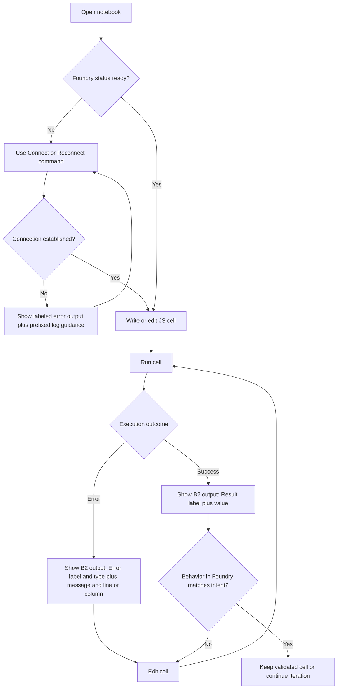
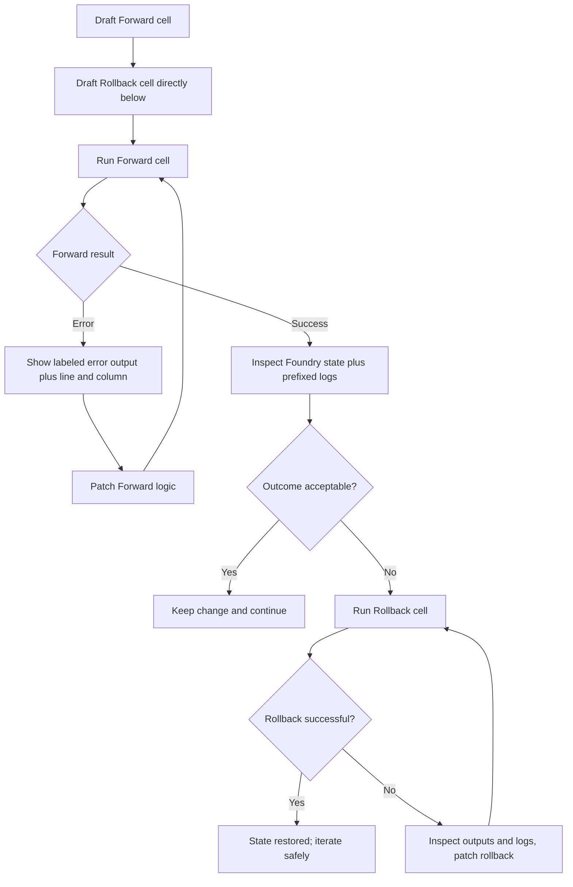
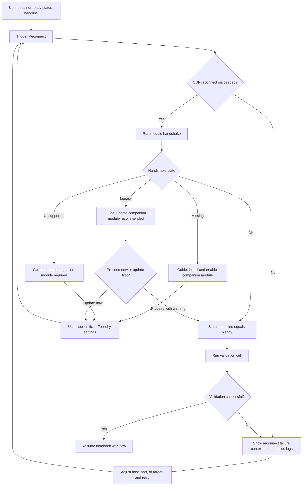

# User Journey Flows

### Journey 1: Rapid Macro Iteration Loop

Goal: let a user move from idea to validated macro behavior with minimum cycle time and zero ambiguity about execution outcome.

Progress and feedback model:

- Entry point: notebook open with Foundry kernel.
- Key decisions: run now vs reconnect first; keep result vs iterate.
- Success signal: labeled Result output and expected Foundry state change.
- Primary confusion risk: silent or no-op perception.
- Recovery: explicit Error envelope plus retry loop back to edit and run.

### Journey 2: Safe Experimentation and Reversal

Goal: enable risky mutations with immediate rollback confidence.

Progress and feedback model:

- Entry point: known risky operation.
- Key decisions: keep forward change vs rollback.
- Success signal: explicit confirmation that state is restored or accepted.
- Primary confusion risk: partial rollback.
- Recovery: run rollback again after patching with value checks.

### Journey 3: Environment and Connection Management

Goal: restore working execution quickly after reload or restart, or module drift.

Progress and feedback model:

- Entry point: disconnected or degraded status.
- Key decisions: retry config vs fix module state.
- Success signal: Ready status plus successful validation cell.
- Primary confusion risk: connection and module issues conflated.
- Recovery: explicit handshake-state guidance path before retry.

### Journey Patterns

Navigation patterns:

- Always return to the notebook cell as the primary action surface.
- Use command-triggered recovery for reconnect, then resume the same cell loop.

Decision patterns:

- Gate execution trust through visible readiness state before run.
- On each run, branch only into success-continue or error-edit-retry.

Feedback patterns:

- B2 cell envelope provides immediate semantic result or error framing.
- C2 prefixed logs provide chronological context for multi-step debugging.

### Flow Optimization Principles

- Minimize steps to value: keep run, edit, and rerun inside one notebook context.
- Reduce cognitive load: one clear status headline at a time (A2).
- Keep diagnostics actionable: label errors with type plus line and column before deep detail.
- Preserve reversible experimentation: encourage forward and rollback cell pairing.
- Favor recovery over dead ends: every failure branch returns to a concrete next action.
