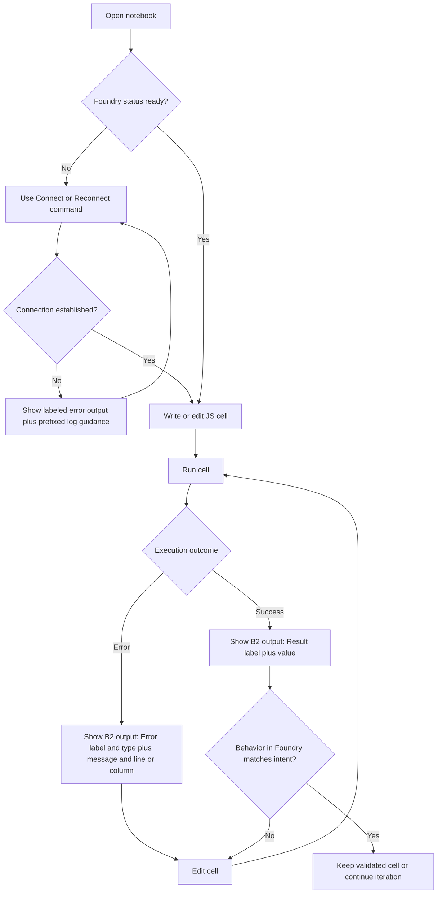
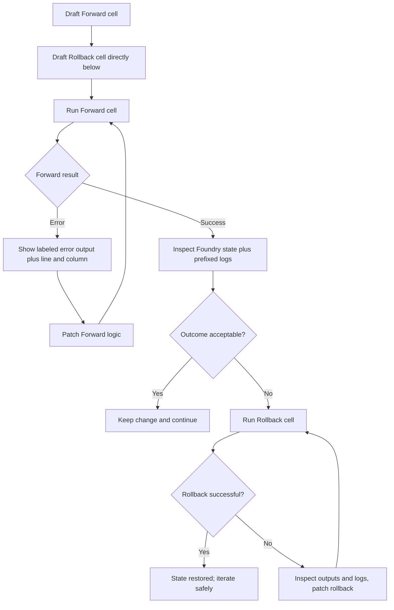
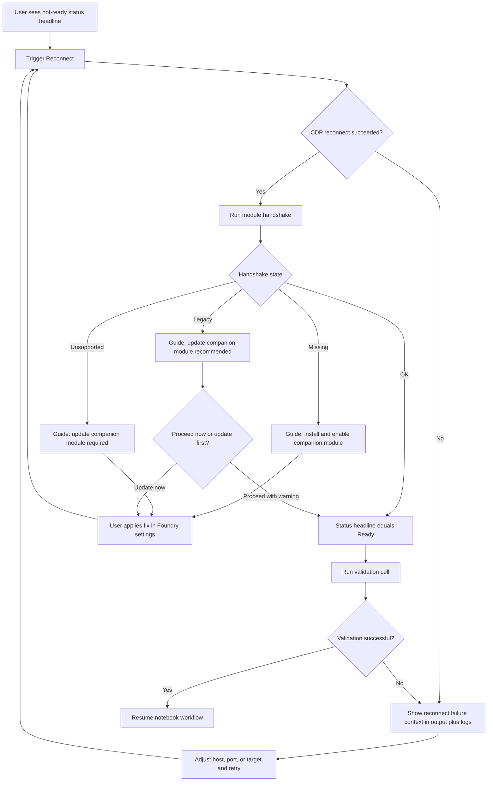

---
stepsCompleted:
  - 1
  - 2
  - 3
  - 4
  - 5
  - 6
  - 7
  - 8
  - 9
  - 10
  - 11
  - 12
  - 13
  - 14
lastStep: 14
inputDocuments:
  - docs/prd.md
  - docs/product-brief.md
---

# UX Design Specification foundry-devil-code-sight

**Author:** Sylvercode
**Date:** 2026-03-15

---

<!-- UX design content will be appended sequentially through collaborative workflow steps -->

## Executive Summary

### Project Vision

foundry-devil-code-sight transforms Foundry macro work from a cramped, minimal editor experience into a deliberate IDE-native iteration loop. The product's UX purpose is to reduce the friction of writing, testing, and refining JavaScript macros by giving users clear execution feedback and a faster path from idea to validated behavior.

### Target Users

Primary users are Foundry macro authors who are already comfortable with JavaScript, including advanced hobby scripters and experienced professional developers. Users who feel blocked or irritated by Foundry's minimal macro UI are especially strong candidates and are likely to see this extension as essential rather than optional.

### Key Design Challenges

- Replacing a high-friction Foundry macro workflow with a low-friction notebook loop without increasing cognitive load.
- Making execution outcomes unmistakably clear, since notebook output clarity is the most important V1 UX surface.
- Designing for technically capable users who expect IDE-grade feedback speed and precision, not simplified beginner abstractions.
- Keeping interaction patterns optimized for desktop-only usage, with no mobile accommodation assumptions.

### Design Opportunities

- Turn output clarity into the flagship UX differentiator through structured, readable, high-signal result/error presentation.
- Create a confidence loop where users can run, inspect, and refine macros quickly enough to feel immediate productivity gains.
- Position the extension as a must-have power tool for users frustrated by Foundry's native macro UI, especially those with professional development habits.

## Core User Experience

### Defining Experience

The core experience of foundry-devil-code-sight is a tight write-run-verify loop for JavaScript macros executed against a live Foundry session. Users should be able to write code, execute immediately, observe clear results, and iterate without workflow interruption. The value is sustained momentum: less context switching, less uncertainty, faster refinement.

### Platform Strategy

The product is designed for desktop VS Code workflows and optimized for keyboard-and-mouse interaction. The execution model assumes an active browser connection to Foundry, making connection observability a first-class UX requirement rather than a background diagnostic detail.

### Effortless Interactions

- Writing and executing code should feel immediate and repeatable.
- Connection state should be obvious at a glance so users know whether executions can reach Foundry.
- Re-running snippets should be friction-resistant, minimizing state-collision interruptions that make iteration feel brittle.
- Output should clearly indicate what happened after each run so users never confuse execution failure with no-op behavior.

### Critical Success Moments

- First proof moment: user executes a snippet and immediately sees clear, trustworthy evidence that Foundry received and ran it.
- Trust moment: user can rerun and refine the same snippet multiple times without confusing state-related breakage.
- Failure cliff: when a user runs code and sees no clear effect or feedback, the product is perceived as buggy and unusable.

### Experience Principles

- Make execution outcomes unmistakable.
- Make connection status continuously legible.
- Preserve iteration flow over ceremony.
- Design for rerun confidence, not one-shot execution.

## Desired Emotional Response

### Primary Emotional Goals

The dominant emotion after successful execution should be satisfaction — the quiet, grounded feeling of a craftsperson whose tool did exactly what was expected. Not excitement or relief, but the stable confidence of control. The product earns loyalty by making this feeling repeatable, not occasional.

### Emotional Journey Mapping

- Discovery / first run: cautious curiosity transitioning to proof — users need one clean execution to begin trusting the tool.
- During active iteration: calm focus — the connection is legible, output is clear, there is no noise demanding attention.
- On error: informed and steady — errors are clinical (exact location, cause, and actionable detail) and reassuring (nothing outside the notebook is broken).
- Returning to the tool: readiness — the extension feels already staged, connection state is visible immediately, and the user can dive back in without re-orienting.

### Micro-Emotions

- Target: confidence, calm, satisfaction, trust
- Acceptable: focus, efficiency, readiness
- Avoid: irritation from workarounds, confusion about execution state, anxiety about breaking Foundry state, frustration from workflow slowdowns introduced by the tool itself

### Design Implications

- Satisfaction → output must be structured and readable enough that users can immediately see success or identify failure without decoding raw CDP responses.
- Calm → connection status should be continuously legible without demanding attention; a persistent ambient indicator rather than modal alerts.
- Both (clinical + reassuring) on errors → error output should always include name, message, line/column, and stack where available; framing should imply "here is what happened and you can fix it" not "something exploded."
- Readiness → on reconnect or session resume, status should resolve quickly and visibly, so users arrive at a known state, not an uncertain one.

### Emotional Design Principles

- Never make the tool the source of friction it was built to eliminate.
- Calm is a feature: ambient status visibility over intrusive alerts.
- Trust is built through consistency: the same execution produces the same class of feedback every time.
- Errors are tools, not failures: treat them as diagnostic data, not alarming interruptions.

## UX Pattern Analysis & Inspiration

### Inspiring Products Analysis

**VS Code (environment)**  
Users already know and trust VS Code. The extension's greatest UX advantage is that it inherits the entire VS Code interaction vocabulary: keyboard shortcuts, the Problems panel, inline error markers, status bar conventions, and command palette patterns. Users do not need to learn a new tool shell — they need to learn one new extension in a familiar container. The integrated error UX (red underlines, line/column markers, Problems list) sets a high standard for how execution failures should be surfaced in cell output.

**Jupyter Notebooks**  
Jupyter defines the mental model users bring to this product: write a snippet, run it, see the result inline, iterate. The speed and simplicity of the Jupyter cell loop is the interaction baseline users expect. Immediate visible output per cell, the ability to rerun any cell independently, and clear separation between code and its result are all patterns to preserve faithfully.

**VS Code Debug and Diagnostics UX**  
Inline error markers and the Problems panel demonstrate that errors are most scannable when they pinpoint location (file, line, column) and are visually anchored to the source. As macros grow more complex, users need more than raw output — they need structured observation through logging and value watching to understand what is happening inside a running script.

### Transferable UX Patterns

- **Cell-output co-location (Jupyter)**: output renders directly beneath its originating cell — adopt this as the primary execution feedback surface.
- **Inline error anchoring (VS Code)**: errors should include line/column and, where feasible, surface near their origin — not only in a separate panel.
- **Status bar ambient state (VS Code)**: persistent, low-noise status indicators in a familiar location communicate connection state without interrupting the editing flow.
- **Problems panel severity model (VS Code)**: distinguish error severity (syntax vs. runtime) clearly using familiar VS Code conventions so users recognize the class of failure immediately.
- **Incremental output logging (VS Code Output Channel)**: intentional log output separated from noise is a proven pattern for longer-running operations — apply this to `$f.log()` output.

### Anti-Patterns to Avoid

- **Silent execution (Foundry native editor)**: execution that produces no visible feedback — success or failure — destroys trust immediately. Every execution must produce observable output.
- **Undifferentiated console noise**: mixing intentional script output with unrelated browser log noise forces users to hunt for signal — this is exactly the problem we replace.
- **Modal or intrusive status alerts**: pop-up connection warnings or modal dialogs break focus during active iteration — ambient, persistent status is preferred.
- **Opaque errors without location**: errors that only say "something failed" without message, line, or column force the same guesswork that Foundry's editor already imposes.

### Design Inspiration Strategy

**Adopt:**

- Jupyter's cell-run-output visual contract as the execution feedback model.
- VS Code's Problems panel severity vocabulary for classifying execution errors.
- VS Code's status bar conventions for ambient connection state.

**Adapt:**

- VS Code's inline error markers — apply the principle (errors anchor to their source) within notebook cell output, rather than the literal editor gutter marker implementation, scoped to MVP feasibility.
- Jupyter's rerun model — add the constraint that rerunning must not trip on already-declared variables, making iteration more reliable than a raw notebook.

**Avoid:**

- Any pattern that mirrors Foundry's native macro editor: no silent runs, no undifferentiated output, no missing error location data.

## Design System Foundation

### Design System Choice

This product spans two distinct design environments, each with its own native design system:

**Surface 1 - VS Code extension**: VS Code native extension UX patterns (notebook output, status bar, output channels, command palette, inline diagnostics).

**Surface 2 - Foundry companion module**: Foundry VTT's native module settings panel UI within the Foundry application.

### Rationale for Selection

- VS Code surface: users are already inside VS Code; every native pattern is zero-learning-curve UX leverage. V1 defers custom webview UI entirely, using `OutputChannel` and notebook cell output as the primary surfaces.
- Foundry surface: the companion module's settings page lives inside Foundry's own FormApplication UI. Foundry has its own established design vocabulary (module settings panels, form inputs, dialogs). The companion module must look and feel like a native Foundry module, not a foreign design import.

### Implementation Approach

**VS Code surfaces:**

- Notebook cell output: VS Code notebook output MIME types for structured text, errors, and metadata display.
- Connection status: VS Code status bar item with legible state labels and ambient color cues.
- Error output: structured text in cell results with name, message, line, column, and stack.
- Intentional script logging: VS Code `OutputChannel` - familiar, unobtrusive, developer-native.
- Module handshake feedback: status bar tooltip or command output - no modal interruption.

**Foundry companion module surface:**

- A minimal settings page within Foundry's module settings panel: the only required UX here for V1.
- Settings should follow Foundry's standard module settings registration patterns (using `game.settings.register`) so they render natively within Foundry's existing settings UI.
- V1 scope for this surface is intentionally minimal: version display, enable/disable state, and any runtime configuration the module needs to expose to the Foundry side.
- This surface should never compete visually with Foundry's own UI - it must feel like a natural extension of it.

### Customization Strategy

- VS Code surface: no custom design tokens or component libraries for V1. Information design focus only - what data to show, in what order, at what detail level.
- Foundry surface: use Foundry's native `game.settings` UI conventions. No custom HTML templates beyond what Foundry's settings system already provides for V1. Any future companion module UI expansion (for example a dedicated module configuration panel) is post-MVP scope.

## Detailed Core User Experience

### Defining Experience

The defining experience of foundry-devil-code-sight is rapid JavaScript macro iteration from a VS Code notebook against a live Foundry world. Users open a notebook, run code, see the result, adjust, and rerun with minimal friction. The product wins when this loop feels faster and more reliable than Foundry's native macro editor workflow.

### User Mental Model

Users approach this product with an established VS Code/Jupyter mental model:

- notebook cells are executable units
- each execution should produce immediate visible feedback
- errors should point to exact source location
- status indicators should communicate readiness before execution

Before trusting execution, users expect two readiness signals:

1. Connection is alive.
2. Module handshake is OK, meaning Foundry is alive and reachable in a valid tab context.

### Success Criteria

The core interaction is successful when:

- users can open a notebook with Foundry kernel and begin execution immediately
- each run returns visible value/output or explicit error
- errors include actionable location detail (line/column where available)
- users can rerun quickly without breaking iteration flow
- execution impact is visible in at least one trusted surface: Foundry state, notebook cell result, or intentional log output

### Novel UX Patterns

For V1, the experience should remain almost entirely within established VS Code/Jupyter interaction patterns to reduce learning cost and maximize trust:

- standard notebook run loop
- familiar status signaling
- familiar diagnostics style

Intentional novelty is deferred to V2:

- Foundry-specific quality-of-life workflows exposed through VS Code commands
- deeper domain shortcuts built on top of the trusted V1 foundation

### Experience Mechanics

**1. Initiation**

- User opens a notebook configured with Foundry kernel.
- If connection is already configured, session initializes automatically and readiness becomes visible.

**2. Interaction**

- User writes a JavaScript snippet in a cell.
- User executes the cell in the notebook run flow.

**3. Feedback**

- System returns value/output on success.
- On failure, system returns clear error diagnostics with location details.
- Readiness context (connection + handshake) remains legible to support trust.

**4. Completion**

- User observes visible impact from execution in one or more trusted surfaces:
  - Foundry world behavior/state
  - notebook cell result
  - intentional runtime log output
- User either iterates again or keeps the snippet as a validated macro step.

## Visual Design Foundation

### Color System

No custom brand color palette is defined for V1. The extension should use native VS Code theme definitions and semantic state coloration so user personalization remains respected across themes.

**Status Color Semantics (token-first, no hardcoded colors):**

- Connected/ready: use VS Code success/active semantic colors (typically green or blue depending on theme).
- Connecting: use a lower-emphasis variant of ready state (or default VS Code intermediate/active state styling).
- Handshake unsupported: use VS Code warning semantic color (typically yellow/amber).
- Missing module or execution error: use VS Code error semantic color (typically red).
- Disconnected/inactive: use VS Code inactive/disabled semantic styling (grayed).

Color strategy principle: rely on VS Code semantic tokens and component states first, so all user theme customization is automatically honored.

### Typography System

Typography remains fully native VS Code. The extension should not introduce custom typefaces or custom typographic branding for V1.

Typography hierarchy should be expressed through structure and semantic formatting:

- notebook output headings for sectioning
- concise labels for status and diagnostics
- consistent monospace rendering for code-adjacent values and error details

This keeps cognitive load low and preserves immediate familiarity for developers.

### Spacing & Layout Foundation

Target density is **balanced**: neither compressed log-dump density nor overly spacious presentation.

Layout principles:

- keep execution result, status, and error context close to the originating cell
- preserve scannability with clear section boundaries
- avoid large visual containers or modal surfaces that break notebook flow
- maintain consistent spacing rhythm across output blocks and status annotations

For the companion module settings surface in Foundry:

- follow Foundry's default settings layout and spacing conventions
- keep the module UI minimal and information-first

### Accessibility Considerations

Accessibility baseline follows the user's active VS Code theme. The extension should preserve semantic status signaling (success/warning/error/inactive) and avoid hardcoded color dependencies that could reduce theme accessibility.

Given user-managed theming in VS Code:

- the extension should remain theme-compliant by default
- strong contrast needs are expected to be addressed through the user's chosen VS Code theme configuration
- semantic indicators should always include textual meaning (not color alone) where practical in output/status messaging

## Design Direction Decision

### Design Directions Explored

Step 9 evaluated focused implementation decisions inside fixed VS Code surfaces rather than inventing alternative layout systems. Three decision areas were explored:

- **Decision A (Status bar signaling):** A1 two-pill model vs A2 combined single-pill model.
- **Decision B (Cell output envelope):** B1 minimal output vs B2 labeled semantic output vs B3 structured metadata-rich envelope.
- **Decision C (Output channel line format):** C1 timestamp + value vs C2 prefixed source label + timestamp + value.

### Chosen Direction

The approved Step 9 direction is:

- **A2**: single combined status pill
- **B2**: labeled semantic cell output envelope
- **C2**: prefixed output channel entries

### Design Rationale

- **A2 (single-pill status):** favors compactness and lower status-bar footprint. The extension communicates one authoritative readiness headline at a time, reducing peripheral visual noise.
- **B2 (labeled semantic envelope):** balances clarity and speed. Each run communicates success or failure instantly with explicit labels and concise location-aware error detail, without adding heavy metadata to routine iterations.
- **C2 (prefixed logs):** improves scanability when users move between channels or copy/paste output. Each entry carries explicit source identity without relying on surrounding panel context.

This combination intentionally prioritizes explicitness and repeatable diagnostics over minimalism.

### Implementation Approach

For V1 implementation, apply the direction as follows:

- **Status bar item:** render a single dynamic pill string representing current state (disconnected, connecting, ready, unsupported, missing), with semantic iconography and color aligned to VS Code status conventions.
- **Notebook cell output:** standardize a labeled semantic envelope for every run. On success, render a clear result label and value. On failure, render error label/type, message, and line/column (plus stack summary when available).
- **Output channel formatting:** prepend each intentional `$f.log()` line with a source label and timestamp to create stable, grep-friendly diagnostics during longer sessions.

Guardrails:

- Keep all presentation inside native VS Code surfaces.
- Preserve the companion module UI in Foundry's native settings surface only.
- Maintain textual meaning alongside semantic color cues for accessibility and theme compatibility.

## User Journey Flows

### Journey 1: Rapid Macro Iteration Loop

Goal: let a user move from idea to validated macro behavior with minimum cycle time and zero ambiguity about execution outcome.

Progress and feedback model:

- Entry point: notebook open with Foundry kernel.
- Key decisions: run now vs reconnect first; keep result vs iterate.
- Success signal: labeled Result output and expected Foundry state change.
- Primary confusion risk: silent or no-op perception.
- Recovery: explicit Error envelope plus retry loop back to edit and run.

### Journey 2: Safe Experimentation and Reversal

Goal: enable risky mutations with immediate rollback confidence.

Progress and feedback model:

- Entry point: known risky operation.
- Key decisions: keep forward change vs rollback.
- Success signal: explicit confirmation that state is restored or accepted.
- Primary confusion risk: partial rollback.
- Recovery: run rollback again after patching with value checks.

### Journey 3: Environment and Connection Management

Goal: restore working execution quickly after reload or restart, or module drift.

Progress and feedback model:

- Entry point: disconnected or degraded status.
- Key decisions: retry config vs fix module state.
- Success signal: Ready status plus successful validation cell.
- Primary confusion risk: connection and module issues conflated.
- Recovery: explicit handshake-state guidance path before retry.

### Journey Patterns

Navigation patterns:

- Always return to the notebook cell as the primary action surface.
- Use command-triggered recovery for reconnect, then resume the same cell loop.

Decision patterns:

- Gate execution trust through visible readiness state before run.
- On each run, branch only into success-continue or error-edit-retry.

Feedback patterns:

- B2 cell envelope provides immediate semantic result or error framing.
- C2 prefixed logs provide chronological context for multi-step debugging.

### Flow Optimization Principles

- Minimize steps to value: keep run, edit, and rerun inside one notebook context.
- Reduce cognitive load: one clear status headline at a time (A2).
- Keep diagnostics actionable: label errors with type plus line and column before deep detail.
- Preserve reversible experimentation: encourage forward and rollback cell pairing.
- Favor recovery over dead ends: every failure branch returns to a concrete next action.

## Component Strategy

### Design System Components

The product continues with a native-first component strategy:

- VS Code native surfaces for status, notebook output, and output channel.
- Foundry native module settings UI for companion configuration.
- No custom webview component library in V1.

Foundation components reused from host systems:

- VS Code status bar item.
- VS Code notebook cell output rendering.
- VS Code output channel text stream.
- Foundry module settings form controls (`game.settings.register`-backed UI).

Coverage outcome:
Most UX is delivered by content contracts inside native components, not by introducing custom visual containers.

### Custom Components

### Status Headline Contract (A2)

**Purpose:** Provide one authoritative readiness headline at a time in the status bar.  
**Usage:** Always visible during connected workflow; updates on connection and handshake transitions.  
**Anatomy:** icon + state label + optional companion version token.  
**States:**

- `Disconnected`
- `Connecting`
- `Module Missing`
- `Ready $(companionVersion)`
- `Legacy $(companionVersion)`
- `Unsupported $(companionVersion)`

**Variants:** none in V1 (single-line status headline only).  
**Accessibility:** textual state always present; color is supplemental only.  
**Content Guidelines:** keep wording short, deterministic, and mutually exclusive.  
**Interaction Behavior:** state refreshes on reconnect, handshake completion, and module state changes.

### Cell Output Envelope Contract (B2)

**Purpose:** Make every run outcome instantly readable without metadata overload.  
**Usage:** Render for every cell execution result.  
**Anatomy:**

- Success: semantic result label + primary value
- Error: semantic error label + type + message + location anchor
- Optional metadata: duration (if enabled in extension settings)

**States:**

- Success
- Error
- Error with expanded stack details
- Error with collapsed stack details (default)

**Variants:**

- Duration shown (setting enabled)
- Duration hidden (setting disabled)

**Accessibility:**

- Semantic labels on all outputs (`Result`, `Error`)
- Error locations represented as text, not color-only cues
- Stack disclosure has keyboard-focusable toggle semantics

**Content Guidelines:**

- Keep the first line high-signal: status and error type
- Keep line and column visible without expansion
- Include called-function source line when resolvable, alongside executing cell line

**Interaction Behavior:**

- Stack trace collapsed by default
- User can expand stack details on demand
- Error line is highlighted in cell code
- When available, display both the cell line and underlying called-function line reference

### Output Log Entry Contract (C2)

**Purpose:** Provide intentional, grep-friendly runtime breadcrumbs in output channel.  
**Usage:** For `$f.log()` and other intentional extension-scoped runtime messages.  
**Anatomy:** fixed prefix + timestamp + payload text or value.  
**Prefix:** `FOUNDRY-DCS` (fixed, non-configurable in V1).  
**States:** info baseline in V1; severity shaping can be layered later if needed.  
**Accessibility:** plain-text readable format, no color dependency.  
**Content Guidelines:**

- Keep each entry single-line when practical
- Preserve chronological ordering
- Avoid noisy diagnostic duplication already shown in cell output

**Interaction Behavior:** append-only stream per session; supports copy and search workflows.

### Component Implementation Strategy

Foundation-first approach:

- Use host-native components for rendering and interaction mechanics.
- Implement custom behavior as formatting and state contracts over those primitives.

Contract-first priorities:

1. Status headline state machine mapped to connection and companion handshake outcomes.
2. B2 cell envelope formatter with optional duration and default-collapsed stack details.
3. In-cell error line emphasis with dual-location support (cell line + called-function line when available).
4. Fixed-prefix log formatter (`FOUNDRY-DCS`) for intentional output channel entries.

Consistency rules:

- One authoritative status headline at a time.
- One semantic output envelope per run.
- One fixed log identity prefix across all sessions.

### Implementation Roadmap

Phase 1 - Core Components (MVP-critical):

- Status Headline Contract (A2)
- Cell Output Envelope Contract (B2 baseline: result or error labels, message, line and column)
- Fixed Log Prefix Contract (C2 with `FOUNDRY-DCS`)

Phase 2 - Diagnostic Depth (still within V1 boundaries if capacity allows):

- Optional duration controlled by extension setting
- Collapsible stack disclosure in cell output (default collapsed)
- In-cell error highlighting with robust anchor behavior

Phase 3 - Precision Enhancements:

- Called-function source line display alongside cell line where trace mapping allows
- Additional polish for multi-error readability and copy or paste diagnostics hygiene

## UX Consistency Patterns

### Button Hierarchy

V1 uses a command-first, notebook-first interaction model, so traditional button hierarchies are intentionally minimal.

Primary actions:

- Run cell
- Reconnect

Secondary actions:

- Expand stack details
- Open output channel
- Open settings for host, port, and related connection configuration

Pattern rule:

- Promote only actions that keep users in the write-run-verify loop.
- Defer or demote actions that break momentum or force context switching.

### Feedback Patterns

Severity model is standardized:

- **Error**: blocking condition (execution failed, connection unavailable, required update)
- **Warning**: degraded but usable condition (legacy companion version)
- **Info**: neutral progress state (connecting, reconnect attempt, handshake running)
- **Success**: completed operation (execution success, reconnect success, validation pass)

Feedback delivery rules:

- **Inline first** in notebook and status context for immediate user understanding.
- **Output channel mirror** for diagnostics continuity and copy or search workflows.
- Inline message and output-channel mirror should share the same semantic meaning and state label.

Message style rules:

- First line is always high-signal and state-led.
- Error messages include actionable location detail when available.
- Warning messages should explain impact and next best action.
- Info messages should indicate active progress without alarm.

### Form Patterns

Form surfaces in scope:

- VS Code extension settings
- Foundry companion module settings (native Foundry settings UI)

Validation behavior:

- **Inline validation + output-channel mirror** for config-related errors.
- Inline validation is immediate and specific.
- Output-channel mirror includes prefixed diagnostic context for later troubleshooting.

Validation content rules:

- Identify the exact invalid field or state.
- Provide one clear corrective action.
- Avoid vague failure language.

Settings consistency rules:

- Keep technical labels explicit (host, port, version, handshake state).
- Preserve deterministic value formatting.
- Avoid introducing custom form paradigms that differ from host ecosystems.

### Navigation Patterns

Primary navigation model is loop-based and recovery-first:

1. Write or edit cell
2. Run cell
3. Inspect result
4. Iterate or recover

Reconnect recovery priority:

- On connection failure, first suggested action is always **Reconnect**.
- If reconnect fails repeatedly, then surface targeted settings adjustments.
- Return users to the same notebook loop as soon as readiness is restored.

Command behavior consistency:

- Reconnect is idempotent and safe to repeat.
- Recovery commands should never leave the user in an ambiguous state.
- Every failure branch must end with a concrete next action.

### Additional Patterns

#### Loading States

Status headline uses concise host-consistent wording:

- `Connecting`

If supported by the VS Code ecosystem or context, provide tooltip detail:

- `Connecting to Foundry...`

Loading pattern rules:

- Keep inline or loading language short.
- Use tooltip or detail text for additional context, not primary labels.
- Never present loading without a visible current state.

#### Empty States

For V1, stay aligned with standard Jupyter behavior and avoid adding decorative empty-state messaging.

Pattern rule:

- Prefer neutral or empty baseline over custom explanatory empty cards.
- Only introduce explicit empty guidance if a real usability gap appears in testing.

#### Error Detail Disclosure

- Stack details are collapsed by default.
- Users can expand on demand.
- Error line should be highlighted in cell code.
- When available, show both executing cell line and called-function source line.

#### Log Identity Pattern

Output channel entries use a fixed identity prefix:

- `FOUNDRY-DCS`

Consistency rule:

- Prefix remains fixed across sessions and messages for reliable scan and search behavior.

## Responsive Design & Accessibility

### Responsive Strategy

Product scope is desktop-only.

In-scope:

- Standard desktop VS Code windows
- Narrow desktop workspace layouts (panel resizing, split editors, reduced horizontal space)

Out-of-scope for V1:

- Tablet-specific UX
- Mobile-specific UX

Responsive behavior principles:

- Prefer host-native reflow behavior from VS Code surfaces.
- Keep extension-specific content compact and robust under panel narrowing.
- Preserve the write-run-verify loop even when notebook and output panes are constrained.

### Breakpoint Strategy

No numeric breakpoints are defined in-product.

Strategy:

- Defer layout breakpoint mechanics to VS Code's native workbench and panel management.
- Design extension content contracts to remain legible in both standard and compact host layouts.
- Avoid custom media-query-driven layout systems for V1.

### Accessibility Strategy

Accessibility strategy follows host alignment:

- Match VS Code baseline accessibility behavior and interaction conventions.
- Do not introduce custom accessibility models that diverge from VS Code norms in V1.
- Keep semantic text labels for core states where already defined by component contracts.
- Treat additional accessibility hardening beyond host baseline as a future enhancement unless required by observed usability issues.

### Testing Strategy

Minimal V1 testing approach:

Responsive checks:

- Validate behavior in normal desktop layout and at least one narrow panel configuration.
- Confirm core loop remains usable with resized notebook and output areas.

Accessibility checks:

- Basic keyboard sanity pass for default actionable interactions.
- Confirm command-palette-first workflows remain available for primary actions.
- Verify that state labels and core messages remain text-readable in default themes.

Testing scope note:

- No full assistive-tech matrix in V1.
- Expand testing depth post-MVP if user feedback indicates accessibility gaps.

### Implementation Guidelines

Responsive implementation:

- Use VS Code-native containers and avoid custom layout engines.
- Keep output lines and status copy concise to reduce truncation risk in narrow panes.
- Prefer progressive disclosure (for example, collapsed details) to preserve readability.

Accessibility implementation:

- Reuse host-native controls and semantics wherever possible.
- Ensure minimal default keyboard operability for visible actions.
- Keep command equivalents available for major actions (run, reconnect, open output or settings).
- Avoid color-only signaling for critical run states where a text label already exists.
